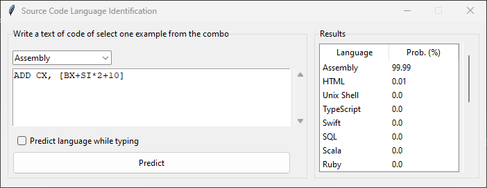
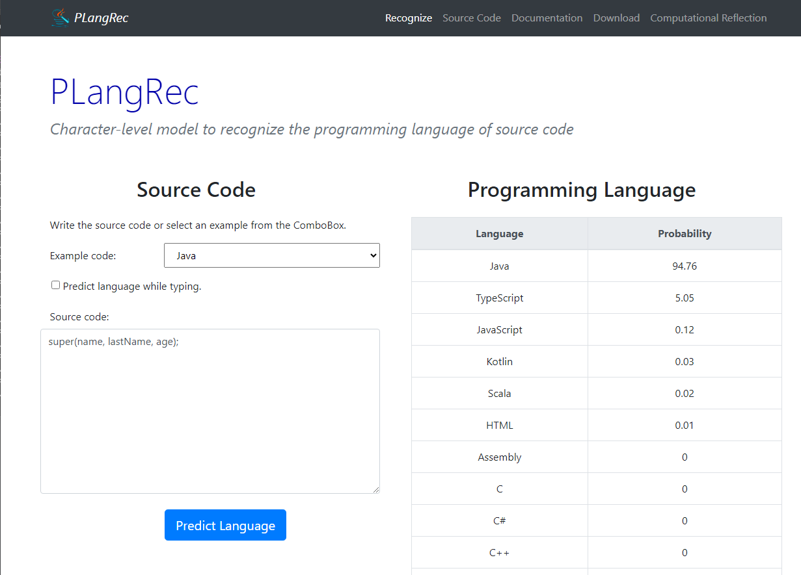

# *PLangRec*

[](LICENSE)
[](https://github.com/ComputationalReflection/PLangRec/releases)


*Programming language recognizer.*

*PLangRec* is a character-level deep model to recognize the programming language of source code.

*PLangRec* is provided as a Python desktop application, web API and web application.

## Python desktop application

Make sure you have Python installed. Then, install all the required packages:

``` bash
    pip install -r requirements.txt --upgrade
``` 

Make sure you have downloaded both the both `common` and the `desktop` folders, and they are
both subdirectories of the same parent directory (the must be sibling directories).

Finally, run *PLangRec* as a Python application (the model will be downloaded from the Internet, 
so the first execution may take minutes):

``` bash
    cd desktop-app
    python main.py
``` 



## Web API

Make sure you have Python installed. Then, install all the required packages:

``` bash
    pip install -r requirements.txt --upgrade
``` 

Make sure you have downloaded both the both `common` and the `web-api` folders, and they are
both subdirectories of the same parent directory (the must be sibling directories).

Finally, run *PLangRec* as a Web API (the model will be downloaded from the Internet, 
so the first execution may take minutes):

``` bash
    cd web-api
    python main.py
``` 

## Web application

For the web application, you need to deploy the Web API
because the application consumes the API.

Steps:

1. Deploy the Web API in one server. 
2. Download the `web-app` folder to your web server. 
3. Modify the value of the `WEB_SERVER` variable in the `index.html` file, 
setting its value to the server where you have the web API (step 1).    

The Web application will be ready, calling the Web API.



## License

[MIT license](LICENSE).
