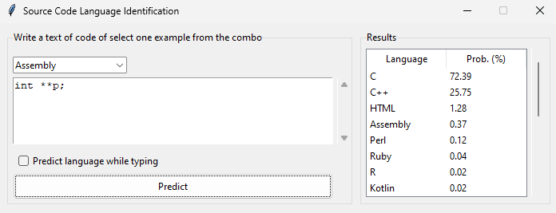

# *PLangRec*

[](LICENSE) 
[](https://github.com/ComputationalReflection/PLangRec/releases)


*PLangRec* is a system designed to recognize the programming language of a source code excerpt. 

*PLangRec* is provided as a Python desktop application, web API and web application.
In this document, we describe the desktop Python application.

## Installation

First, install the latest release of Python 3. We have used Python 3.11, so any higher version should work. 

Second, install all the required packages, either using a virtual environment or modifying the system Python.
The simplest approach to install the required packages is to use the `requirements.txt` file with pip:

``` bash
pip install -r requirements.txt --upgrade
``` 

Third, place both `common` and the `desktop` folders as sibling directories. 
That is, they must be subdirectories of the same parent directory.

Finally, run the *PLangRec* desktop application as a Python program. 
The model and meta-model will be downloaded from the Internet, 
so the first execution may take minutes (be patient). 
This is how you run the desktop application:

``` bash
cd desktop-app
python main.py
``` 

## Functionality

The desktop application provides a simple interface to recognize the programming language of a source code excerpt.
This is how the desktop application looks like:


Users can input the source code into the text area in the middle of the left hand side of the application.
They can either type their own code or select examples from different pieces of code 
for the 21 programming languages supported, using the dropdown list (assembly is the first language). 

When the "predict language" button is clicked, the probabilities for the 21 languages 
(sorted in descending order) inferred by *PLangRec* are displayed in the "Results" area. 
Both languages and probabilities can be sorted by clicking on their respective titles. 

Additionally, the application supports language prediction while typing.
To enable that behavior, the "Predict language while typing" checkbox
must be enabled. Prediction probabilites are updated as the user types.

## Example

The following figure shows an example of the desktop application in action.
The user just typed a variable declaration line that is valid for both C and C++ languages.
In that case, *PLangRec* predicts both languages with high probabilities, 
selecting C as the most likely language because that kind of declaration is more common in the C
code used for training the model. However, the user can see that C++ is also a likely language.



If the user adds a second line of code, the prediction will be more accurate.
In this case, the user added a second line using the `new` operator, that is only provided
by C++. *PLangRec* uses that new line (together with the first one) to now predict C++ 
as the most likely language. We can see that in the following figure:


TODO: add desktop-example-2.png image the with the following code:
int **p;
p = new int*[10];

The more code the user types, the more accurate the prediction will be.


## License

[MIT license](LICENSE).
