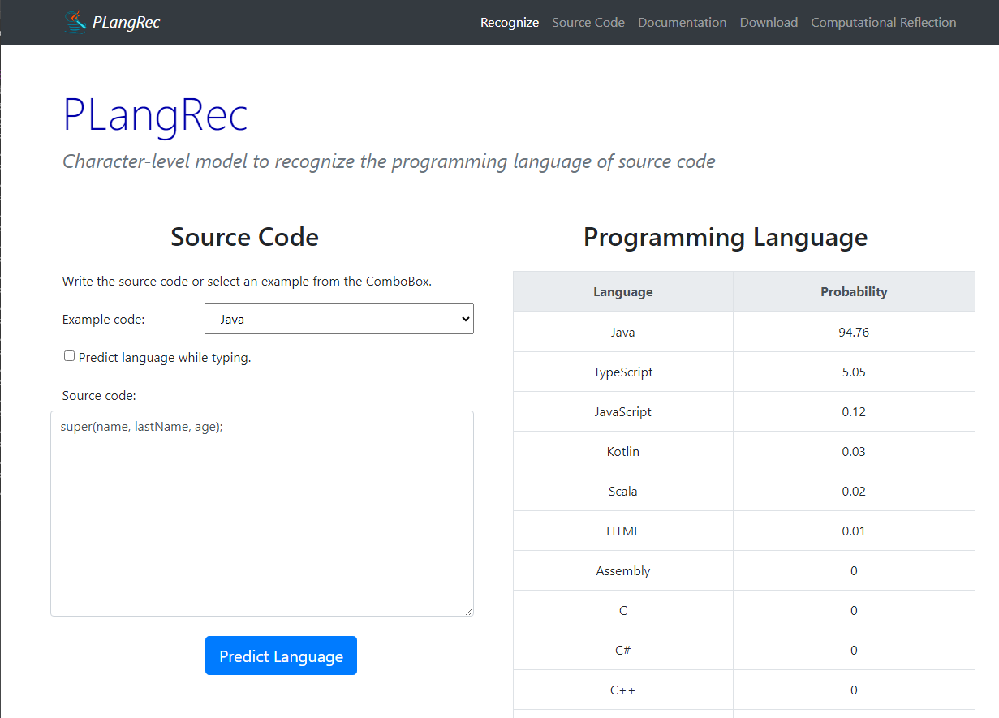

# *PLangRec*

 

*PLangRec* is a system designed to recognize the programming language of a source code excerpt. 

*PLangRec* is provided as a Python desktop application, web API and web application.
In this document, we describe the desktop web application.

## Installation

The *PLangRec* web application is a web-based interface to recognize 
the programming language of a source code excerpt.
It is a mere front-end to the *PLangRec* web API. 
This means that you need to have the web API running to use the web application.
If you do not have it, you can use the one we provide at https://www.reflection.uniovi.es/plangrec/webapi/BRNN/.

To install the web application, please follow the next steps:

1. Deploy the Web API in one server (or use ours).
2. Download the `web-app` folder in your web server.
3. Modify the value of the `WEB_SERVER` variable in the 
`index.html` file. Set its value to the server where you have deployed the 
web API (step 1).

That is all. The Web application will be up un running.
It will perform calls to the Web API to predict the programming language of the source code.

## Functionality

The web application provides a simple interface to recognize the programming language 
of a source code excerpt. It has been designed to be responsive (different devices can be used) and easy to use.

This is how the desktop web application looks like in a desktop computer:

Users can input the source code into the left hand side of the application, below the `Source code` label.
They can either type their own code or select examples from different pieces of code 
for the 21 programming languages supported, using the dropdown list 
(assembly is the first language). 

When the "Predict Language" button is clicked, the probabilities for the 21 languages 
(sorted in descending order) inferred by *PLangRec* are displayed in the 
"Programming Language" area. 
Both languages and probabilities can be sorted by clicking on their respective titles. 

Additionally, the application supports language prediction while typing.
To enable that behavior, the "Predict language while typing" checkbox
must be enabled. Prediction probabilites are updated as the user types.

## Example

The following figure shows an example of the web application in action.
The user just typed a variable declaration line that is valid for both C and C++ languages.
In that case, *PLangRec* predicts both languages with high probabilities, 
selecting C as the most likely language because that kind of declaration is more common in the C
code used for training the model. However, the user can see that C++ is also a likely language.

If the user adds a second line of code, the prediction will be more accurate.
In this case, the user added a second line using the `new` operator, that is only provided
by C++. *PLangRec* uses that new line (together with the first one) to now predict C++ 
as the most likely language. We can see that in the following figure:

The more code the user types, the more accurate the prediction will be.

## License

[MIT license](LICENSE).
